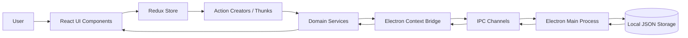
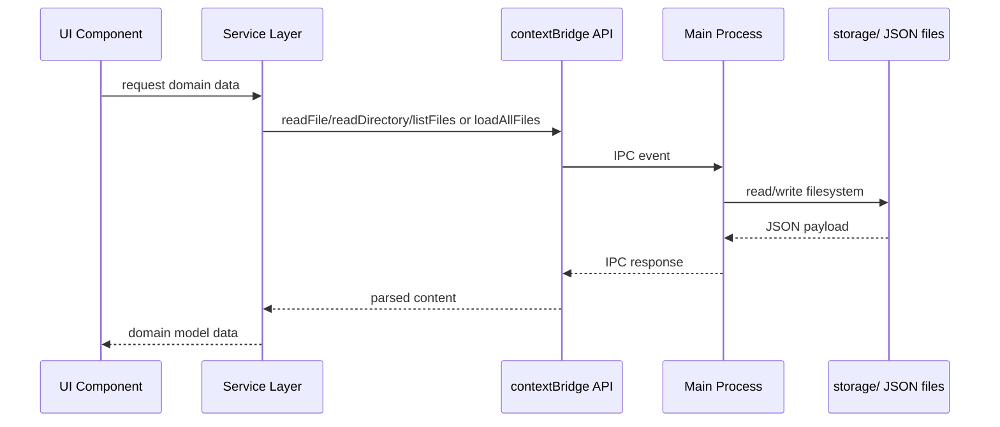
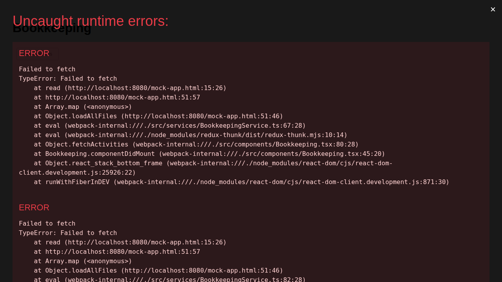
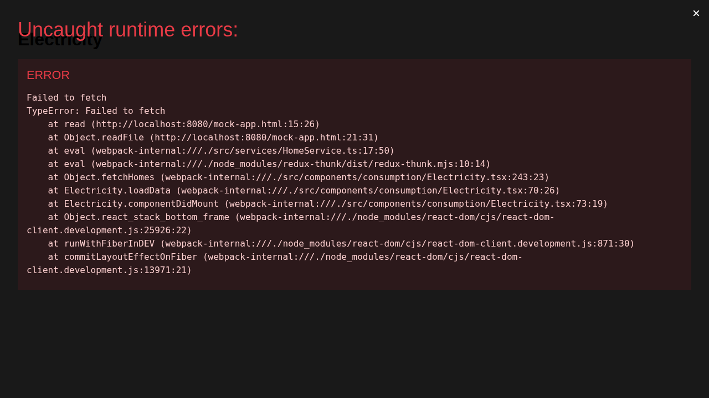
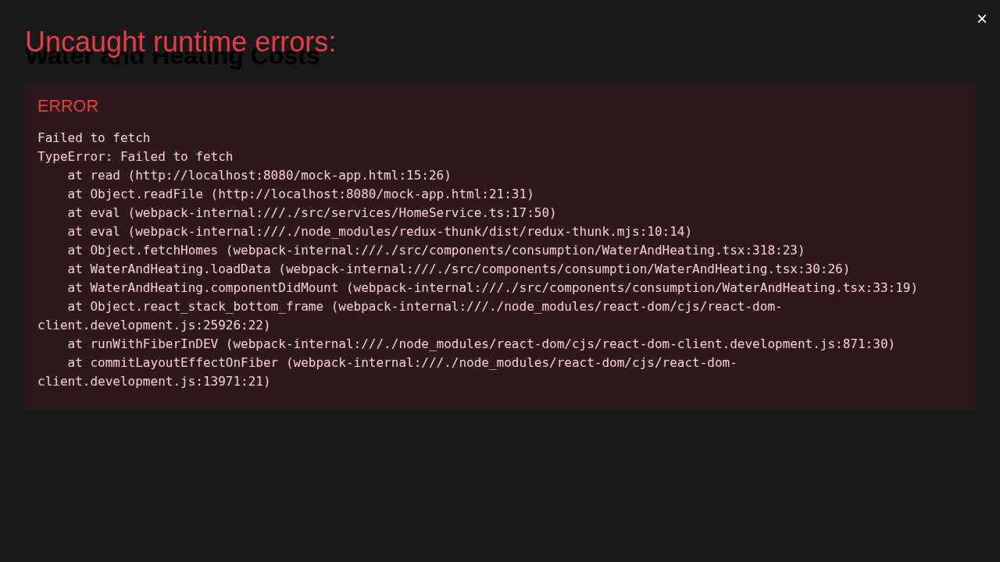
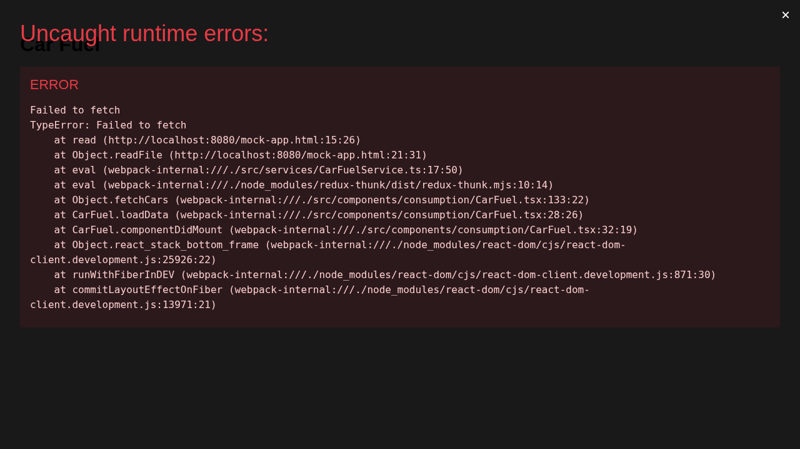
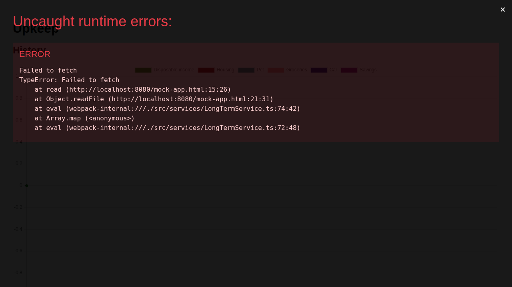
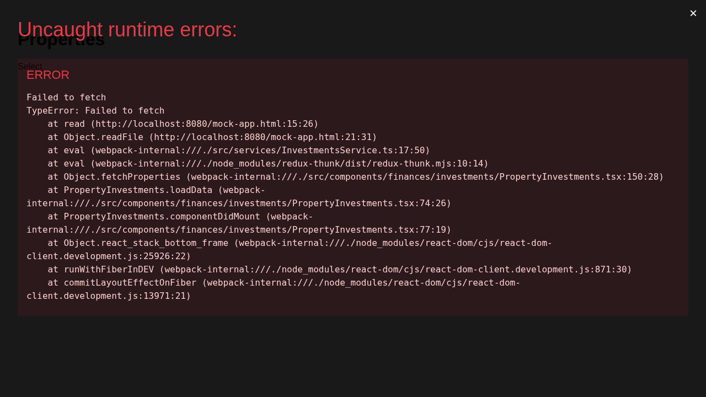

# Arkanos Financial Suite (AFS)

A personal finance desktop suite focused on **bookkeeping, consumption tracking, long-term upkeep planning, savings projection, and property investment follow-up**.

## Project Snapshot

AFS is an Electron + React + TypeScript application that stores financial data as JSON files on disk and provides domain-specific views for:

- Monthly bookkeeping and activity tracking
- Home consumption (electricity, gas, water, heating)
- Car fuel consumption and cost efficiency
- Long-term upkeep planning and historical trend visualization
- Savings reports based on account and activity data
- Property valuation history and investment monitoring

## Badges

### Repository & Delivery

[](https://github.com/matheuscodes/afs/releases)
[](https://github.com/matheuscodes/afs/releases)
[](https://github.com/matheuscodes/afs/commits/main)
[](https://github.com/matheuscodes/afs/commits/main)
[](https://github.com/matheuscodes/afs)
[](https://github.com/matheuscodes/afs)
[](https://github.com/matheuscodes/afs)
[](https://github.com/matheuscodes/afs/issues)
[](https://github.com/matheuscodes/afs/issues?q=is%3Aissue+is%3Aclosed)
[](https://github.com/matheuscodes/afs/pulls)
[](https://github.com/matheuscodes/afs/pulls?q=is%3Apr+is%3Aclosed)
[](./LICENSE)

### CI / Automation

[](https://github.com/matheuscodes/afs/actions/workflows/tests.yml)
[](https://github.com/matheuscodes/afs/actions/workflows/release.yml)

### SonarCloud (Quality & Security)

[](https://sonarcloud.io/project/overview?id=matheuscodes_afs)
[](https://sonarcloud.io/project/overview?id=matheuscodes_afs)
[](https://sonarcloud.io/project/issues?resolved=false&types=BUG&id=matheuscodes_afs)
[](https://sonarcloud.io/project/issues?resolved=false&types=VULNERABILITY&id=matheuscodes_afs)
[](https://sonarcloud.io/project/issues?resolved=false&types=CODE_SMELL&id=matheuscodes_afs)
[](https://sonarcloud.io/project/overview?id=matheuscodes_afs)
[](https://sonarcloud.io/project/overview?id=matheuscodes_afs)
[](https://sonarcloud.io/project/overview?id=matheuscodes_afs)
[](https://sonarcloud.io/project/overview?id=matheuscodes_afs)
[](https://sonarcloud.io/project/overview?id=matheuscodes_afs)

## Technology Stack

- **Desktop runtime:** Electron
- **Frontend:** React + React Router
- **Language:** TypeScript
- **State management:** Redux + Redux Thunk
- **UI toolkit:** Evergreen UI
- **Charts:** Chart.js + react-chartjs-2
- **Bundling/tooling:** Electron Forge + Webpack
- **Tests:** Jest + Testing Library
- **Quality analysis:** SonarCloud

## Architecture

### High-level view



### Runtime data flow



### Main components and folders

| Path | Responsibility |
|---|---|
| `/home/runner/work/afs/afs/src/index.ts` | Electron main process: window/menu setup, IPC handlers, storage read/write |
| `/home/runner/work/afs/afs/src/contextBridge.ts` | Secure preload bridge exposing `storage` and `filesystem` APIs |
| `/home/runner/work/afs/afs/src/Application.tsx` | Route map for all product areas |
| `/home/runner/work/afs/afs/src/components` | React UI grouped by domain (bookkeeping, consumption, finances, upkeep) |
| `/home/runner/work/afs/afs/src/services` | Domain services that load and transform persisted JSON data |
| `/home/runner/work/afs/afs/src/actions` | Redux actions and async thunks |
| `/home/runner/work/afs/afs/src/reducers` | Redux reducers by bounded context |
| `/home/runner/work/afs/afs/src/models` | Domain models and typed entities |
| `/home/runner/work/afs/afs/base` | Bundled seed data copied into packaged artifacts |
| `/home/runner/work/afs/afs/tests` | Unit/integration tests for services, reducers, actions, and components |

### Data layout (seed/base)

```text
base/
  accounting/
  bookkeeping/
  consumption/
    cars/
    homes/
      <home-id>/
        electricity/
        gas/
        water/
        heating/
  long-term/upkeep/
  investments/properties/
    <property-id>/
```

## Runbooks

### Prerequisites

- Node.js version from `.nvmrc`
- npm
- Linux build dependencies for native canvas modules (see workflow):
  - `build-essential libcairo2-dev libpango1.0-dev libjpeg-dev libgif-dev librsvg2-dev pkg-config`

### Install dependencies

```bash
npm ci --legacy-peer-deps
```

### Start application (development)

```bash
npm start
```

### Run tests

```bash
npm test -- --runInBand
```

### Run lint

```bash
npm run lint
```

### Type check

```bash
npx tsc --noEmit
```

### Package application

```bash
npm run package-linux
npm run package-windows
npm run package-mac
```

### Create distributables

```bash
npm run make
```

### Publish with Electron Forge

```bash
npm run publish
```

### Release/deploy runbook (GitHub Actions)

1. Ensure target commit is in `main`.
2. Create and push a git tag (for example `v2.1.0`).
3. The `release.yml` workflow builds on Windows, packages the app, zips artifacts, and publishes a GitHub Release.

## Feature Guide

### 1) Bookkeeping and monthly activities

Tracks monthly financial activities and account movements, with categorized entries and aggregation views.



### 2) Home consumption monitoring

Tracks utility measurements, prices, and payments for electricity/water/heating, helping estimate and compare costs.





### 3) Car fuel monitoring

Captures fuel fill-ups and supports consumption/cost monitoring for vehicles.



### 4) Long-term upkeep planning

Displays upkeep events and history-oriented views to monitor recurring long-term expenses.



### 5) Property investments

Tracks property valuation history to support investment follow-up.



> Screenshots were generated from the bundled base dataset (`/base`) through an Electron API mock harness to document UI behavior with representative data.

## Project History

### Timeline

| Date | Milestone |
|---|---|
| 2014-07-08 | Initial spreadsheet-based bookkeeping system introduced (`Adding the Bookkeeping Sheet with data from 2013.`) |
| 2019-12-29 | **v1.0.0** tagged (Excel-era release with credit follow-up updates for 2020) |
| 2021-03-06 | Legacy Excel workbook removed and Electron codebase introduced |
| 2021-03-06 to 2021-04-20 | React, Redux, Evergreen UI, persistence, and routed pages added |
| 2023-02-15 | **v2.0.0** tagged (`Using windows to build.`), establishing release automation for desktop packaging |
| 2026-01-31 | Test suite and Sonar configuration expanded |
| 2026-04-18 | Test-noise fixes and coverage-focused quality improvements |

### v1.0.0 (Excel) vs v2.0.0 (Electron Desktop)

| Area | v1.0.0 (Excel workbook) | v2.0.0 (Electron app) |
|---|---|---|
| Delivery format | Single spreadsheet file (`Bookkeeping.xlsx`) | Cross-platform desktop app (Electron + Webpack) |
| UI paradigm | Worksheet tabs and formulas | Routed React screens and reusable components |
| Data model | Cell formulas + tab conventions | JSON files by domain (bookkeeping, accounting, consumption, upkeep, investments) |
| Persistence | Spreadsheet file storage | File-system backed storage via IPC and preload bridge |
| Extensibility | Formula/worksheet maintenance | Service/action/reducer architecture with domain separation |
| Automation | Manual spreadsheet usage | CI tests + Sonar analysis + release workflow |

### Legacy workbook insights (v1.0.0)

The historical workbook included these major sheets:

- `Targets`
- `Overview`
- `Consumption Control`
- Monthly tabs from `January` to `December`

Core capabilities in the spreadsheet era already covered:

- Savings targets and yearly overview
- Utility usage tracking
- Monthly transaction classification

The modern application keeps those goals while providing maintainable code architecture, automated testing, and release automation.

## Security

Please review [`SECURITY.md`](./SECURITY.md) for vulnerability reporting and support details.
